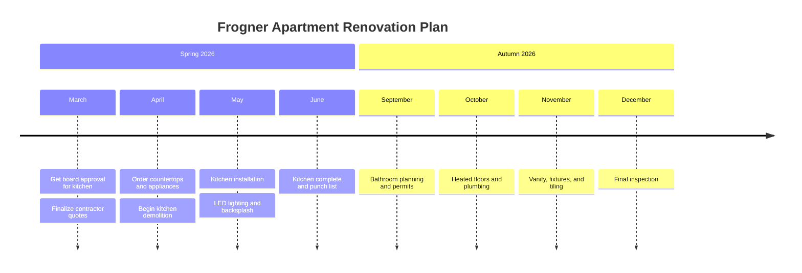

## Apartment Renovation Ideas

Our apartment on Frogner is great but the kitchen and bathroom need updating. Collecting ideas and quotes here.

### Renovation Timeline

### Kitchen

**Current issues:**
- Countertops are stained and scratched (laminate, 15+ years old)
- Not enough storage — no pantry
- Lighting is poor (single ceiling fixture)
- Dishwasher is dying (makes grinding noises)

**Wishlist:**
- Quartz countertops (white or light gray)
- Under-cabinet LED lighting
- Bosch or Miele dishwasher
- Pull-out pantry cabinet
- New tile backsplash (subway tiles?)
- Keep existing oak cabinets — they are actually nice, just need new handles

**Quotes received:**
- KjøkkenPartner AS: NOK 85,000 (counters + backsplash + install)
- Maxbo: NOK 12,000 (just countertops, DIY install)
- IKEA: NOK 45,000 (full remodel with their kitchen planner)

### Bathroom

Lower priority, but collecting ideas:
- Heated floor mats (Warmup brand recommended by neighbors)
- Rainfall showerhead
- Better ventilation fan
- New vanity with more storage

### Timeline

Thinking spring 2026 for kitchen, bathroom can wait until autumn. Need to check with the housing cooperative about renovation rules — probably need board approval for any plumbing changes.

### Inspiration

Saved pins on our shared Pinterest board: "Frogner Kitchen Ideas"
