# Chart Gallery

A showcase of all 24 Mermaid diagram types supported by the Graph builder in Obesian Oats. Each type has its own interactive graph note — open them to see the visual builder in action.

---

## Structural Diagrams

### Flowchart
The classic diagram for processes, workflows, and decision trees. Nodes connect with arrows showing direction and flow. Supports left-to-right, top-to-bottom, and other orientations.

**Best for:** CI/CD pipelines, decision trees, process flows, system overviews

📊 [[Chart Gallery/CI-CD Pipeline Flowchart|Open in Graph Builder]]

```mermaid
%% mode: flowchart
flowchart LR
  Dev["Developer Push"] --> Lint["Lint & Format"]
  Lint --> Test["Unit Tests"]
  Test --> Build["Build"]
  Build --> Docker["Docker Image"]
  Docker --> Scan["Security Scan"]
  Scan --> Stage["Deploy Staging"]
  Stage --> Smoke["Smoke Tests"]
  Smoke --> Approve["Manual Approval"]
  Approve --> Prod["Deploy Production"]
  Prod --> Monitor["Health Check"]
  Monitor --> Alert["Alert on Failure"]
  Alert -->|rollback| Stage
```

### DAG (Directed Acyclic Graph)
Like a flowchart but strictly one-directional — no cycles allowed. Perfect for dependency trees where order matters.

**Best for:** Build dependencies, task ordering, data pipelines, module relationships

📊 [[Chart Gallery/Build Dependencies DAG|Open in Graph Builder]]

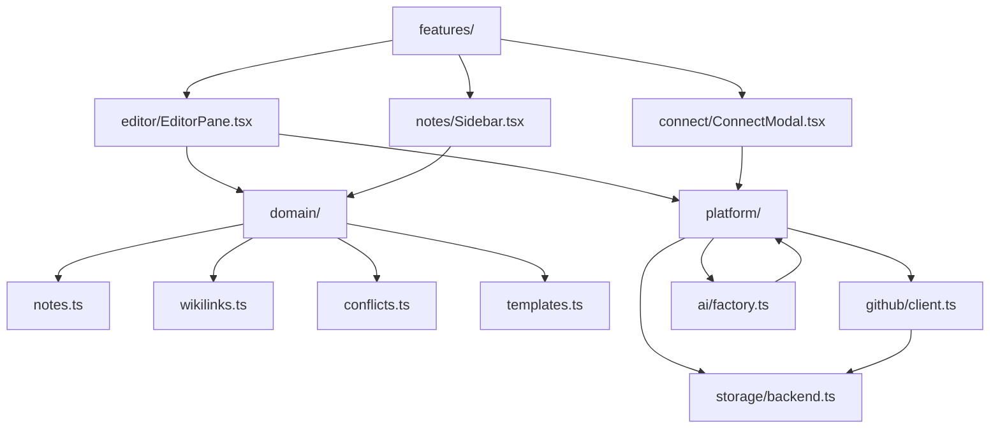
```mermaid
%% preset: dag
flowchart TB
  Domain["domain/"] --> Notes["notes.ts"]
  Domain --> Wikilinks["wikilinks.ts"]
  Domain --> Conflicts["conflicts.ts"]
  Domain --> Templates["templates.ts"]
  Platform["platform/"] --> GitHub["github/client.ts"]
  Platform --> Storage["storage/backend.ts"]
  Platform --> AI["ai/factory.ts"]
  Features["features/"] --> Editor["editor/EditorPane.tsx"]
  Features --> Sidebar["notes/Sidebar.tsx"]
  Features --> Connect["connect/ConnectModal.tsx"]
  Editor --> Domain
  Editor --> Platform
  Sidebar --> Domain
  Connect --> Platform
  GitHub --> Storage
  AI --> Platform
```

### Block Diagram
Layered blocks showing system components in a structured grid. Groups related services together visually.

**Best for:** Microservice architectures, system layers, component overviews

📊 [[Chart Gallery/Microservice Architecture Block|Open in Graph Builder]]

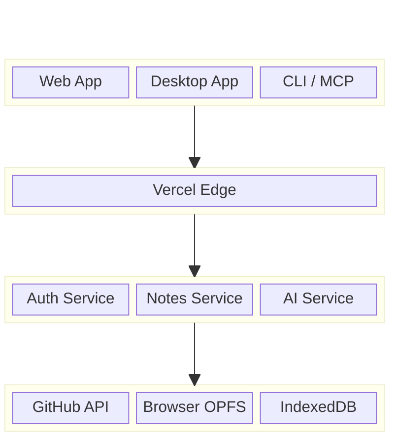
```mermaid
%% preset: block
block-beta
  columns 3

  space:3

  block:clients["Client Layer"]:3
    Web["Web App"]
    Desktop["Desktop App"]
    CLI["CLI / MCP"]
  end

  space:3

  block:api["API Gateway"]:3
    Gateway["Vercel Edge"]
  end

  space:3

  block:services["Service Layer"]:3
    Auth["Auth Service"]
    Notes["Notes Service"]
    AI["AI Service"]
  end

  space:3

  block:storage["Storage Layer"]:3
    GitHub["GitHub API"]
    OPFS["Browser OPFS"]
    IDB["IndexedDB"]
  end

  clients --> api
  api --> services
  services --> storage
```

### Architecture Diagram
Purpose-built for cloud and infrastructure diagrams with service icons and directional connections between groups.

**Best for:** Cloud infrastructure, deployment topology, network diagrams

📊 [[Chart Gallery/Cloud Infrastructure Architecture|Open in Graph Builder]]

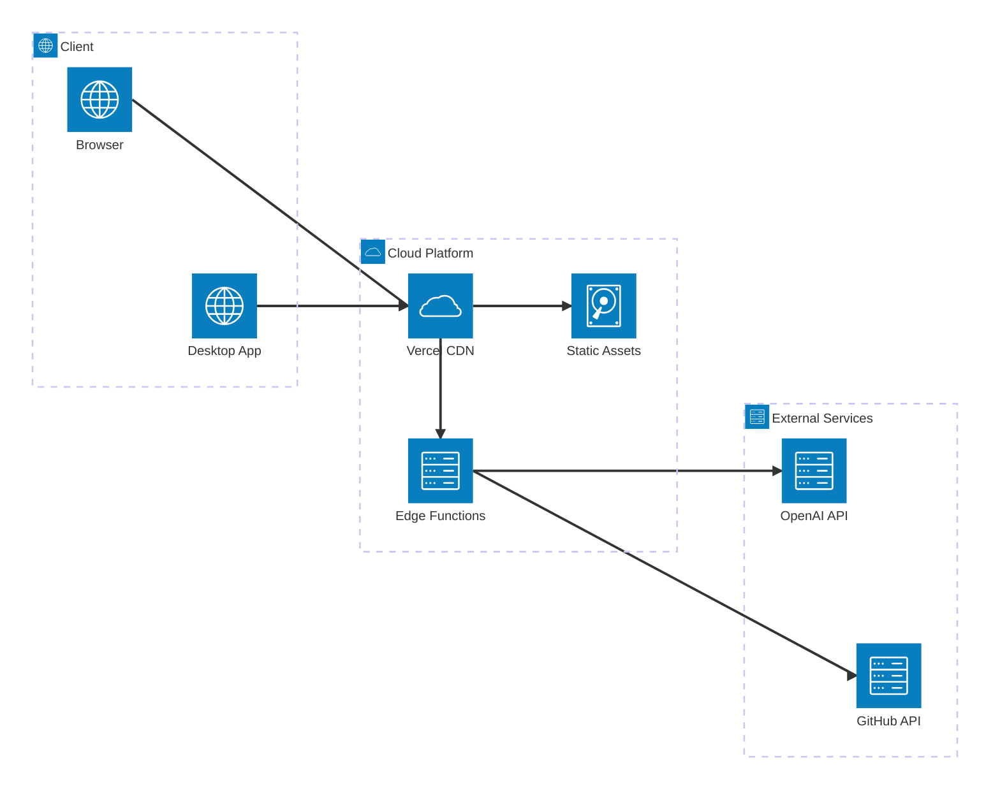
```mermaid
%% preset: architecture
architecture-beta
  group cloud(cloud)[Cloud Platform]

  service vercel(cloud)[Vercel CDN] in cloud
  service edge(server)[Edge Functions] in cloud
  service static(disk)[Static Assets] in cloud

  group external(server)[External Services]

  service github(server)[GitHub API] in external
  service openai(server)[OpenAI API] in external

  group client(internet)[Client]

  service browser(internet)[Browser] in client
  service desktop(internet)[Desktop App] in client

  browser:R --> L:vercel
  desktop:R --> L:vercel
  vercel:R --> L:static
  vercel:B --> T:edge
  edge:R --> L:github
  edge:R --> L:openai
```

---

## Behavioral Diagrams

### Sequence Diagram
Shows interactions between participants over time. Messages flow between vertical lifelines in chronological order.

**Best for:** API flows, authentication handshakes, service communication, protocol design

📊 [[Chart Gallery/API Auth Flow Sequence|Open in Graph Builder]]

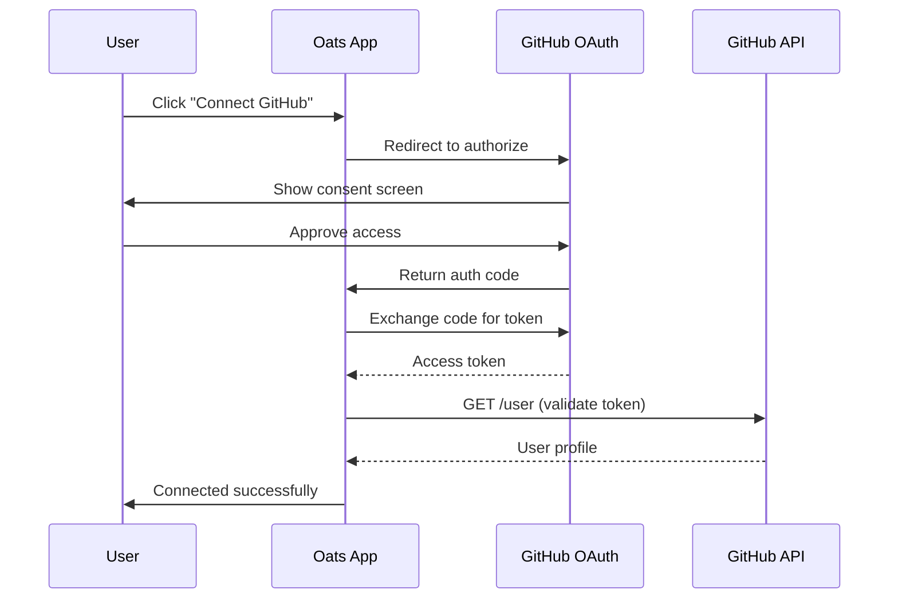
```mermaid
%% preset: sequence
sequenceDiagram
  participant U as User
  participant App as Oats App
  participant GH as GitHub OAuth
  participant API as GitHub API

  U->>App: Click "Connect GitHub"
  App->>GH: Redirect to authorize
  GH->>U: Show consent screen
  U->>GH: Approve access
  GH->>App: Return auth code
  App->>GH: Exchange code for token
  GH-->>App: Access token
  App->>API: GET /user (validate token)
  API-->>App: User profile
  App->>U: Connected successfully
```

### State Diagram
Maps the lifecycle of an entity through its possible states and transitions. Shows what triggers state changes.

**Best for:** Deployment pipelines, order processing, UI state machines, workflow states

📊 [[Chart Gallery/Deployment Lifecycle State|Open in Graph Builder]]

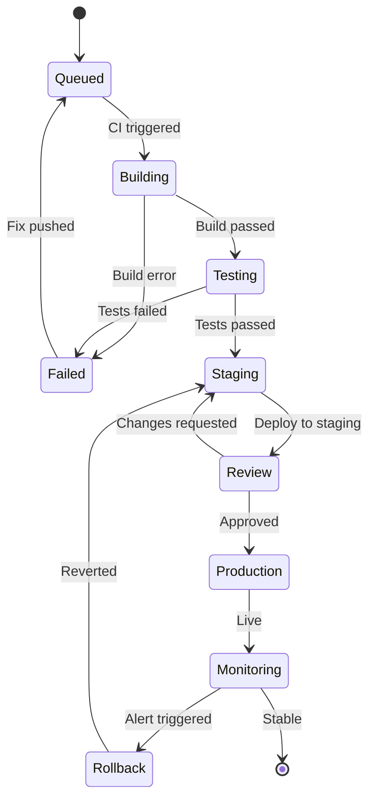
```mermaid
%% preset: state
stateDiagram-v2
  [*] --> Queued
  Queued --> Building: CI triggered
  Building --> Testing: Build passed
  Building --> Failed: Build error
  Testing --> Staging: Tests passed
  Testing --> Failed: Tests failed
  Staging --> Review: Deploy to staging
  Review --> Production: Approved
  Review --> Staging: Changes requested
  Production --> Monitoring: Live
  Monitoring --> Rollback: Alert triggered
  Rollback --> Staging: Reverted
  Failed --> Queued: Fix pushed
  Monitoring --> [*]: Stable
```

### Journey Map
Visualizes a user's experience through a series of steps, rated by satisfaction. Great for identifying pain points.

**Best for:** User onboarding, feature adoption, customer experience mapping

📊 [[Chart Gallery/Developer Onboarding Journey|Open in Graph Builder]]

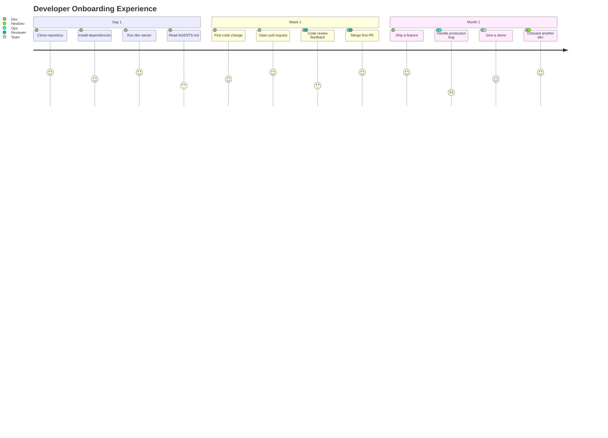
```mermaid
%% preset: journey
journey
  title Developer Onboarding Experience
  section Day 1
    Clone repository: 5: Dev
    Install dependencies: 4: Dev
    Run dev server: 5: Dev
    Read AGENTS.md: 3: Dev
  section Week 1
    First code change: 4: Dev
    Open pull request: 5: Dev
    Code review feedback: 3: Dev, Reviewer
    Merge first PR: 5: Dev, Reviewer
  section Month 1
    Ship a feature: 5: Dev
    Handle production bug: 2: Dev, Ops
    Give a demo: 4: Dev, Team
    Onboard another dev: 5: Dev, NewDev
```

---

## Data & Relationship Diagrams

### Class Diagram
Object-oriented design showing classes, their attributes, methods, and relationships (inheritance, composition).

**Best for:** Domain models, API schemas, object design, code architecture

📊 [[Chart Gallery/Dashboard Domain Model Class|Open in Graph Builder]]

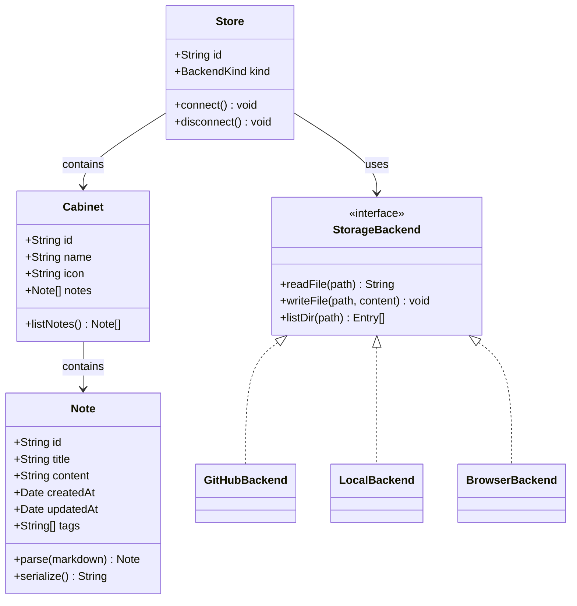
```mermaid
%% preset: class
classDiagram
  class Note {
    +String id
    +String title
    +String content
    +Date createdAt
    +Date updatedAt
    +String[] tags
    +parse(markdown) Note
    +serialize() String
  }
  class Cabinet {
    +String id
    +String name
    +String icon
    +Note[] notes
    +listNotes() Note[]
  }
  class Store {
    +String id
    +BackendKind kind
    +connect() void
    +disconnect() void
  }
  class StorageBackend {
    <<interface>>
    +readFile(path) String
    +writeFile(path, content) void
    +listDir(path) Entry[]
  }
  Store --> Cabinet : contains
  Cabinet --> Note : contains
  Store --> StorageBackend : uses
  StorageBackend <|.. GitHubBackend
  StorageBackend <|.. LocalBackend
  StorageBackend <|.. BrowserBackend
```

### ER Diagram
Entity-Relationship diagrams for database schema design. Shows tables, columns, and relationships between entities.

**Best for:** Database design, data modeling, schema documentation

📊 [[Chart Gallery/Analytics Database ER|Open in Graph Builder]]

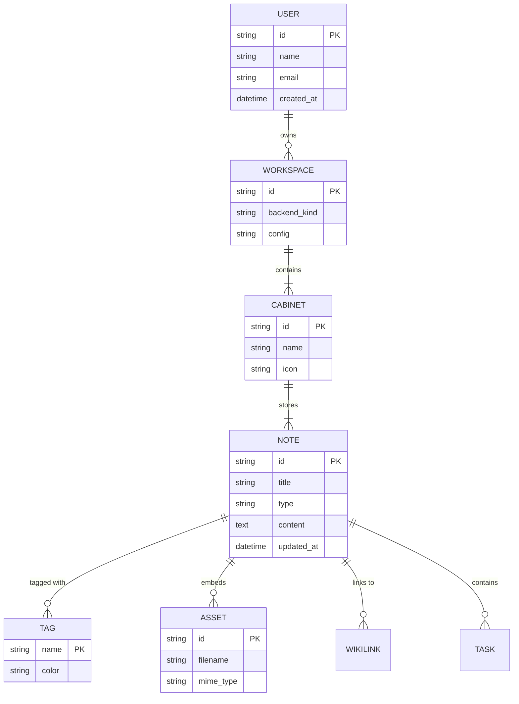
```mermaid
%% preset: er
erDiagram
  USER ||--o{ WORKSPACE : owns
  WORKSPACE ||--|{ CABINET : contains
  CABINET ||--|{ NOTE : stores
  NOTE ||--o{ TAG : "tagged with"
  NOTE ||--o{ ASSET : embeds
  NOTE ||--o{ WIKILINK : "links to"
  NOTE ||--o{ TASK : contains
  USER {
    string id PK
    string name
    string email
    datetime created_at
  }
  WORKSPACE {
    string id PK
    string backend_kind
    string config
  }
  CABINET {
    string id PK
    string name
    string icon
  }
  NOTE {
    string id PK
    string title
    string type
    text content
    datetime updated_at
  }
  TAG {
    string name PK
    string color
  }
  ASSET {
    string id PK
    string filename
    string mime_type
  }
```

### Requirement Diagram
Traces requirements to implementation elements, showing satisfies/derives/refines relationships.

**Best for:** Security requirements, compliance tracking, specification traceability

📊 [[Chart Gallery/Security Requirements|Open in Graph Builder]]

```mermaid
%% preset: requirement
requirementDiagram

    requirement auth_req {
    id: SEC001
    text: Users must authenticate via OAuth
    risk: high
    verifymethod: test
    }

    requirement encrypt_req {
    id: SEC002
    text: Personal config must be AES256 encrypted
    risk: high
    verifymethod: inspection
    }

    requirement token_req {
    id: SEC003
    text: Tokens stored in IndexedDB only
    risk: medium
    verifymethod: analysis
    }

    requirement byok_req {
    id: SEC004
    text: AI keys never leave the browser
    risk: high
    verifymethod: test
    }

    element github_oauth {
    type: module
    docRef: platform/github/client.ts
    }

    element crypto_module {
    type: module
    docRef: platform/crypto.ts
    }

    github_oauth - satisfies -> auth_req
    crypto_module - satisfies -> encrypt_req
    token_req - deriveReqt -> auth_req
    byok_req - refines -> encrypt_req
```

---

## Planning & Scheduling

### Gantt Chart
Timeline-based project scheduling with tasks, durations, dependencies, and sections. Shows work in progress over time.

**Best for:** Sprint planning, project timelines, release schedules, resource allocation

📊 [[Chart Gallery/Q1 Sprint Schedule Gantt|Open in Graph Builder]]

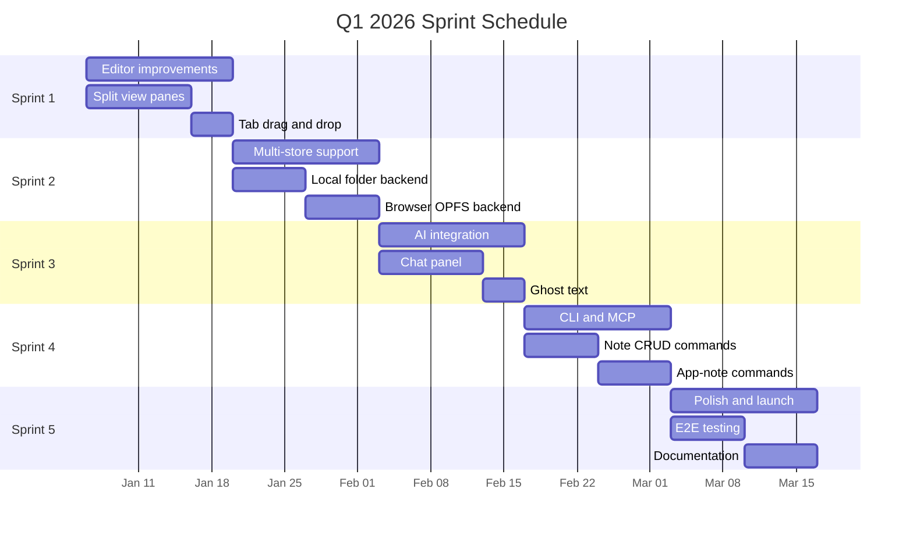
```mermaid
%% preset: gantt
gantt
  title Q1 2026 Sprint Schedule
  dateFormat YYYY-MM-DD
  axisFormat %b %d

  section Sprint 1
    Editor improvements     :s1a, 2026-01-06, 14d
    Split view panes        :s1b, 2026-01-06, 10d
    Tab drag and drop       :s1c, after s1b, 4d

  section Sprint 2
    Multi-store support     :s2a, 2026-01-20, 14d
    Local folder backend    :s2b, 2026-01-20, 7d
    Browser OPFS backend    :s2c, after s2b, 7d

  section Sprint 3
    AI integration          :s3a, 2026-02-03, 14d
    Chat panel              :s3b, 2026-02-03, 10d
    Ghost text              :s3c, after s3b, 4d

  section Sprint 4
    CLI and MCP             :s4a, 2026-02-17, 14d
    Note CRUD commands      :s4b, 2026-02-17, 7d
    App-note commands       :s4c, after s4b, 7d

  section Sprint 5
    Polish and launch       :s5a, 2026-03-03, 14d
    E2E testing             :s5b, 2026-03-03, 7d
    Documentation           :s5c, after s5b, 7d
```

### Kanban Board
Column-based task tracking showing work items moving through stages (Backlog → In Progress → Done).

**Best for:** Sprint boards, workflow management, task tracking

📊 [[Chart Gallery/Sprint Board Kanban|Open in Graph Builder]]

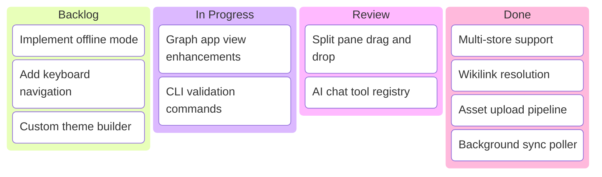
```mermaid
%% preset: kanban
kanban
  column1["Backlog"]
    task1["Implement offline mode"]
    task2["Add keyboard navigation"]
    task3["Custom theme builder"]
  column2["In Progress"]
    task4["Graph app view enhancements"]
    task5["CLI validation commands"]
  column3["Review"]
    task6["Split pane drag and drop"]
    task7["AI chat tool registry"]
  column4["Done"]
    task8["Multi-store support"]
    task9["Wikilink resolution"]
    task10["Asset upload pipeline"]
    task11["Background sync poller"]
```

### Timeline
Chronological milestones grouped by time period. Clean, linear view of key events and deliverables.

**Best for:** Company history, project milestones, product roadmaps, event planning

📊 [[Chart Gallery/Company Milestones Timeline|Open in Graph Builder]]

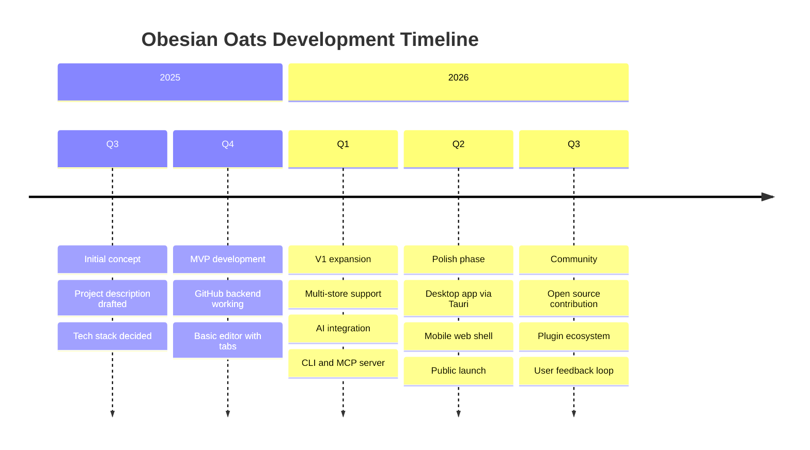
```mermaid
%% preset: timeline
timeline
  title Obesian Oats Development Timeline
  section 2025
    Q3 : Initial concept
       : Project description drafted
       : Tech stack decided
    Q4 : MVP development
       : GitHub backend working
       : Basic editor with tabs
  section 2026
    Q1 : V1 expansion
       : Multi-store support
       : AI integration
       : CLI and MCP server
    Q2 : Polish phase
       : Desktop app via Tauri
       : Mobile web shell
       : Public launch
    Q3 : Community
       : Open source contribution
       : Plugin ecosystem
       : User feedback loop
```

---

## Analytical Diagrams

### Pie Chart
Proportional breakdown of a whole into parts. Simple and effective for showing distribution.

**Best for:** Time allocation, budget breakdown, survey results, category distribution

📊 [[Chart Gallery/Team Time Allocation Pie|Open in Graph Builder]]

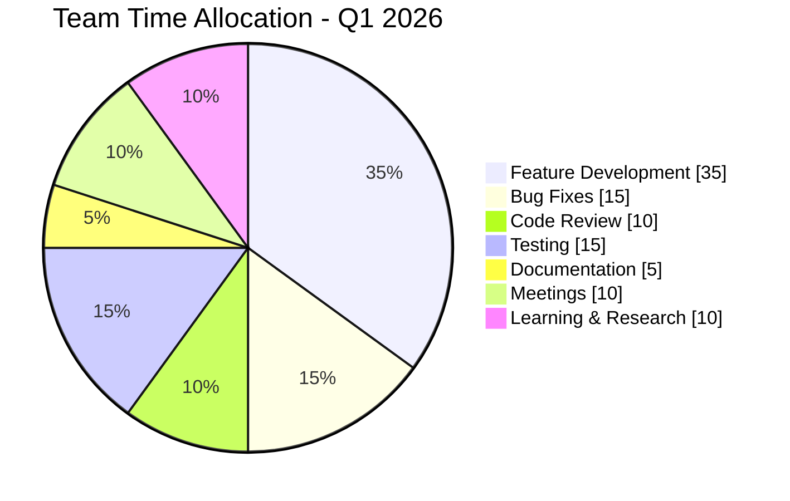
```mermaid
%% preset: pie
pie showData
  title Team Time Allocation - Q1 2026
  "Feature Development" : 35
  "Bug Fixes" : 15
  "Code Review" : 10
  "Testing" : 15
  "Documentation" : 5
  "Meetings" : 10
  "Learning & Research" : 10
```

### Quadrant Chart
2×2 matrix plotting items on two axes. Classic strategic prioritization tool.

**Best for:** Feature prioritization, effort/impact analysis, risk assessment, competitive positioning

📊 [[Chart Gallery/Feature Priority Quadrant|Open in Graph Builder]]

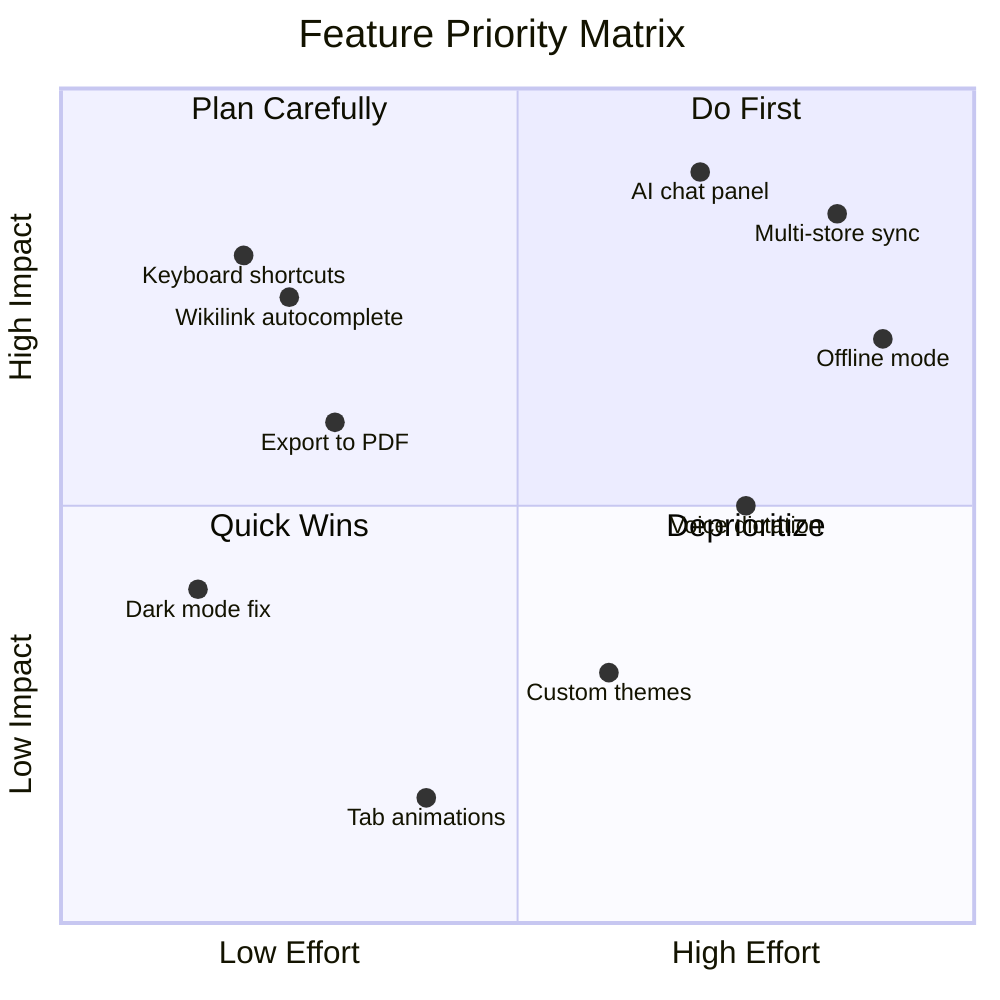
```mermaid
%% preset: quadrant
quadrantChart
  title Feature Priority Matrix
  x-axis Low Effort --> High Effort
  y-axis Low Impact --> High Impact
  quadrant-1 Do First
  quadrant-2 Plan Carefully
  quadrant-3 Quick Wins
  quadrant-4 Deprioritize
  Keyboard shortcuts: [0.2, 0.8]
  AI chat panel: [0.7, 0.9]
  Dark mode fix: [0.15, 0.4]
  Multi-store sync: [0.85, 0.85]
  Custom themes: [0.6, 0.3]
  Export to PDF: [0.3, 0.6]
  Voice dictation: [0.75, 0.5]
  Tab animations: [0.4, 0.15]
  Offline mode: [0.9, 0.7]
  Wikilink autocomplete: [0.25, 0.75]
```

### XY Chart
Bar and line charts with numeric axes. Good for trends, comparisons, and time-series data.

**Best for:** API metrics, usage trends, performance benchmarks, growth charts

📊 [[Chart Gallery/API Request Volumes XY|Open in Graph Builder]]

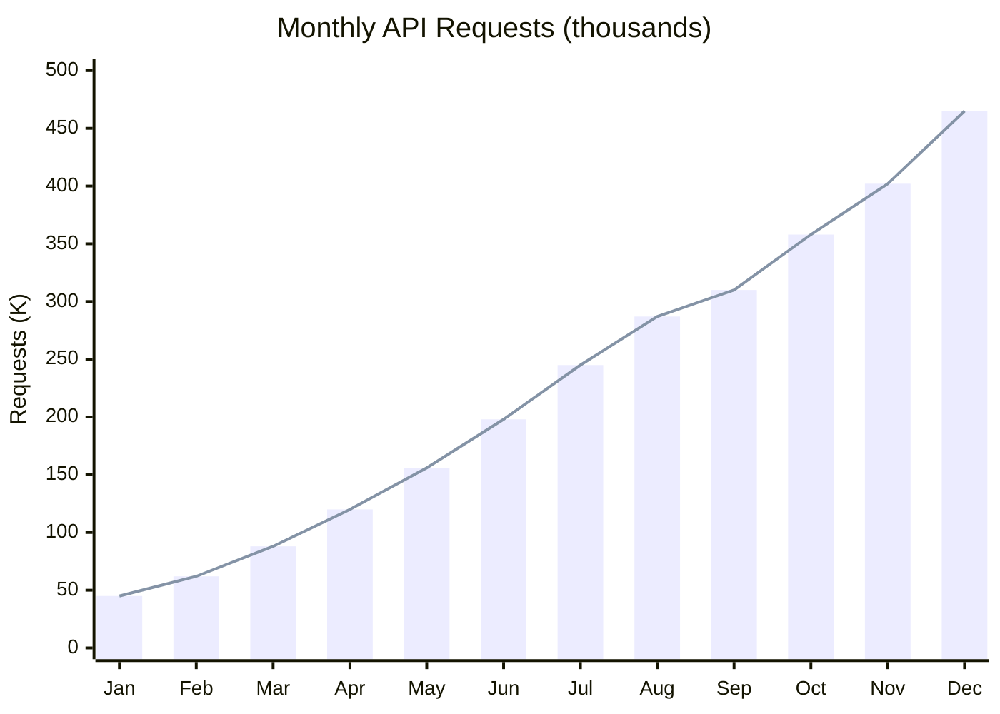
```mermaid
%% preset: xychart
xychart-beta
  title "Monthly API Requests (thousands)"
  x-axis [Jan, Feb, Mar, Apr, May, Jun, Jul, Aug, Sep, Oct, Nov, Dec]
  y-axis "Requests (K)" 0 --> 500
  bar [45, 62, 88, 120, 156, 198, 245, 287, 310, 358, 402, 465]
  line [45, 62, 88, 120, 156, 198, 245, 287, 310, 358, 402, 465]
```

### Radar Chart
Multi-axis spider chart comparing entities across several dimensions simultaneously.

**Best for:** Skills assessment, product comparison, team capabilities, feature coverage

📊 [[Chart Gallery/Team Skills Radar|Open in Graph Builder]]

```mermaid
%% preset: radar
radar-beta
  title Team Skills Assessment
  axis React, TypeScript, Git, DevOps, Architecture, UX Design
  curve Frontend Team { 90, 85, 70, 50, 60, 75 }
  curve Platform Team { 60, 80, 90, 95, 85, 40 }
  curve Design Team { 45, 30, 40, 20, 50, 95 }
```

### Sankey Diagram
Flow diagram where the width of arrows is proportional to the flow quantity. Shows how values distribute through a system.

**Best for:** User funnels, traffic flow, budget allocation, energy/resource flows

📊 [[Chart Gallery/User Traffic Flow Sankey|Open in Graph Builder]]

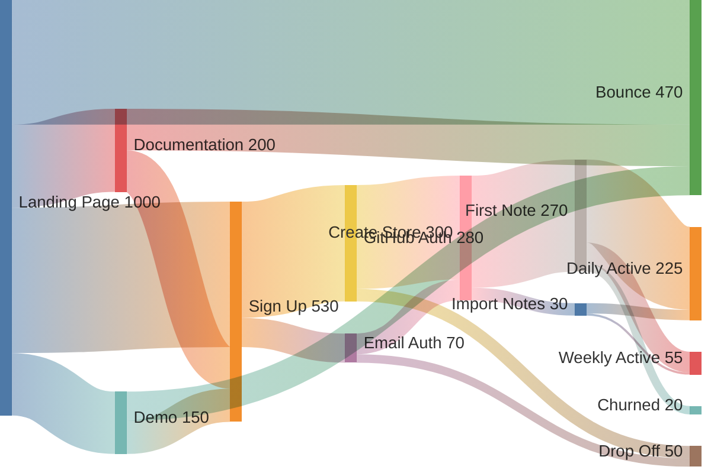
```mermaid
%% preset: sankey
sankey-beta

Landing Page,Sign Up,350
Landing Page,Documentation,200
Landing Page,Demo,150
Landing Page,Bounce,300
Sign Up,GitHub Auth,280
Sign Up,Email Auth,70
GitHub Auth,Create Store,250
GitHub Auth,Drop Off,30
Email Auth,Create Store,50
Email Auth,Drop Off,20
Create Store,First Note,270
Create Store,Import Notes,30
First Note,Daily Active,200
First Note,Weekly Active,50
First Note,Churned,20
Import Notes,Daily Active,25
Import Notes,Weekly Active,5
Documentation,Sign Up,100
Documentation,Bounce,100
Demo,Sign Up,80
Demo,Bounce,70
```

### Treemap
Nested rectangles showing hierarchical data where size represents quantity. Efficient use of space for large datasets.

**Best for:** Codebase sizes, disk usage, organizational structure, portfolio allocation

📊 [[Chart Gallery/Codebase Module Sizes Treemap|Open in Graph Builder]]

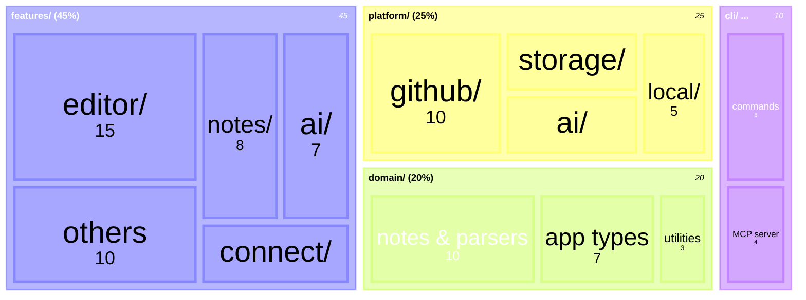
```mermaid
%% preset: treemap
treemap-beta
"features/ (45%)"
  "editor/": 15
  "notes/": 8
  "ai/": 7
  "connect/": 5
  "others": 10
"domain/ (20%)"
  "notes & parsers": 10
  "app types": 7
  "utilities": 3
"platform/ (25%)"
  "github/": 10
  "storage/": 5
  "ai/": 5
  "local/": 5
"cli/ (10%)"
  "commands": 6
  "MCP server": 4
```

---

## Developer Diagrams

### Git Graph
Visualizes Git branching, merging, and commit history. Shows the flow of development across branches.

**Best for:** Branching strategies, release workflows, merge patterns, contribution history

📊 [[Chart Gallery/Release Branching Gitgraph|Open in Graph Builder]]

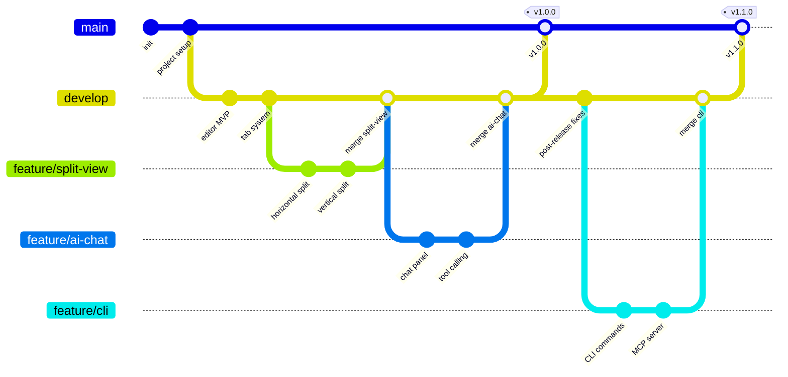
```mermaid
%% preset: gitgraph
gitGraph
  commit id: "init"
  commit id: "project setup"
  branch develop
  checkout develop
  commit id: "editor MVP"
  commit id: "tab system"
  branch feature/split-view
  checkout feature/split-view
  commit id: "horizontal split"
  commit id: "vertical split"
  checkout develop
  merge feature/split-view id: "merge split-view"
  branch feature/ai-chat
  checkout feature/ai-chat
  commit id: "chat panel"
  commit id: "tool calling"
  checkout develop
  merge feature/ai-chat id: "merge ai-chat"
  checkout main
  merge develop id: "v1.0.0" tag: "v1.0.0"
  checkout develop
  commit id: "post-release fixes"
  branch feature/cli
  checkout feature/cli
  commit id: "CLI commands"
  commit id: "MCP server"
  checkout develop
  merge feature/cli id: "merge cli"
  checkout main
  merge develop id: "v1.1.0" tag: "v1.1.0"
```

### C4 Context Diagram
Part of the C4 model for software architecture. Shows system context — people, systems, and their relationships.

**Best for:** System landscape, stakeholder mapping, integration overview

📊 [[Chart Gallery/System Landscape C4|Open in Graph Builder]]

```mermaid
%% preset: c4
C4Context
  title Obesian Oats System Context

  Person(user, "Note Taker", "Creates and organizes markdown notes")
  Person(dev, "Developer", "Uses CLI/MCP for automation")

  System(oats, "Obesian Oats", "Cross-platform notes workspace")

  System_Ext(github, "GitHub", "Repository storage backend")
  System_Ext(openai, "OpenAI API", "AI features provider")
  System_Ext(vercel, "Vercel", "Web hosting platform")

  Rel(user, oats, "Uses", "Browser / Desktop app")
  Rel(dev, oats, "Automates", "CLI / MCP")
  Rel(oats, github, "Reads/writes notes", "REST API")
  Rel(oats, openai, "AI chat, writing tools", "API")
  Rel(oats, vercel, "Deployed on", "Static hosting")
```

### Packet Diagram
Binary data structure visualization showing byte ranges, field names, and sizes in a network packet layout.

**Best for:** Protocol design, API payloads, binary formats, data serialization

📊 [[Chart Gallery/API Request Packet|Open in Graph Builder]]

```mermaid
%% preset: packet
packet-beta
  0-3: "Version (4)"
  4-7: "Type (4)"
  8-15: "Length (8)"
  16-31: "Request ID (16)"
  32-39: "Auth Token Prefix (8)"
  40-55: "Payload Offset (16)"
  56-63: "Checksum (8)"
  64-95: "Payload Data (32)"
```

---

## Design Diagrams

### Wireframe Flow
Uses flowchart syntax with descriptive labels to sketch UI layouts and screen navigation.

**Best for:** UI mockups, screen flows, navigation maps, page layouts

📊 [[Chart Gallery/Dashboard Navigation Wireframe|Open in Graph Builder]]

```mermaid
%% preset: wireframe
flowchart TB
  subgraph Header["Header Bar"]
    Logo["�� Oats"]
    Search["🔍 Search..."]
    Profile["👤 User"]
  end
  subgraph Sidebar["Left Sidebar"]
    Nav["📁 Stores"]
    Tree["📄 Note Tree"]
    Tasks["✅ Tasks"]
    Cal["📅 Calendar"]
  end
  subgraph Main["Editor Area"]
    Tabs["Tab 1 | Tab 2 | Tab 3"]
    Editor["Note Content"]
    Status["Word count: 342"]
  end
  subgraph Inspector["Bottom Drawer"]
    History["📜 History"]
    Assets["🖼 Assets"]
    Links["🔗 Backlinks"]
  end
  Header --- Sidebar
  Header --- Main
  Sidebar --- Inspector
  Main --- Inspector
```

### Mindmap
Radial hierarchy starting from a central concept, branching outward. Great for brainstorming and organizing ideas.

**Best for:** Brainstorming, topic exploration, knowledge organization, planning

📊 [[Chart Gallery/Technology Radar Mindmap|Open in Graph Builder]]

```mermaid
%% mode: mindmap
mindmap
  root((Technology Radar))
    Adopt
      React 19
      TypeScript
      Vite
      Zustand
    Trial
      WebAwesome
      TipTap
      Dexie.js
      Mermaid
    Assess
      Tauri
      OPFS
      Web Crypto API
    Hold
      jQuery
      Webpack
      Redux
      REST-only APIs
```

---

> 💡 **Tip:** Drag and drop any graph note into this document to embed the diagram inline!
