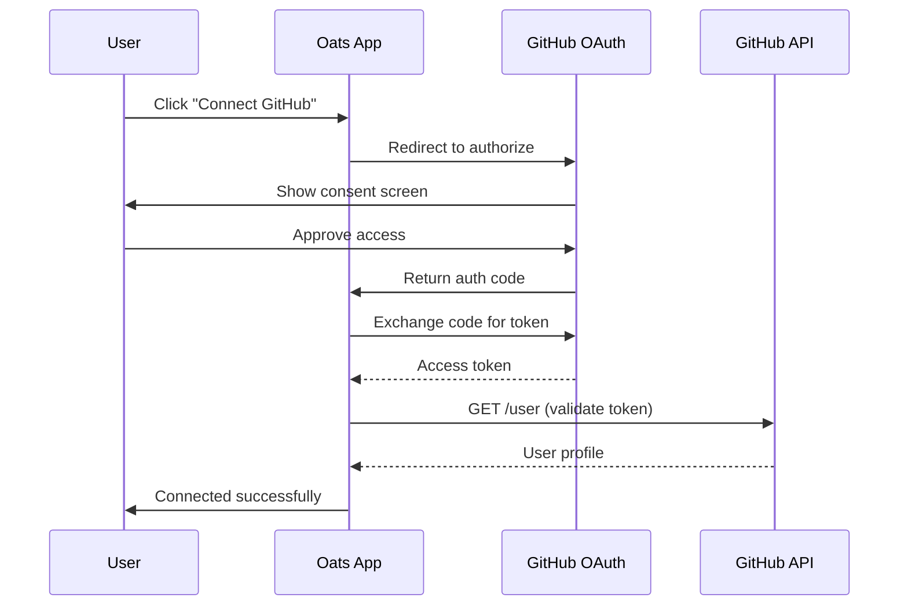

# API Auth Flow Sequence

## Mermaid

```mermaid
%% preset: sequence
sequenceDiagram
  participant U as User
  participant App as Oats App
  participant GH as GitHub OAuth
  participant API as GitHub API

  U->>App: Click "Connect GitHub"
  App->>GH: Redirect to authorize
  GH->>U: Show consent screen
  U->>GH: Approve access
  GH->>App: Return auth code
  App->>GH: Exchange code for token
  GH-->>App: Access token
  App->>API: GET /user (validate token)
  API-->>App: User profile
  App->>U: Connected successfully
```
