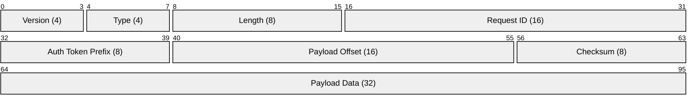

# API Request Packet

## Mermaid

```mermaid
%% preset: packet
packet-beta
  0-3: "Version (4)"
  4-7: "Type (4)"
  8-15: "Length (8)"
  16-31: "Request ID (16)"
  32-39: "Auth Token Prefix (8)"
  40-55: "Payload Offset (16)"
  56-63: "Checksum (8)"
  64-95: "Payload Data (32)"
```
