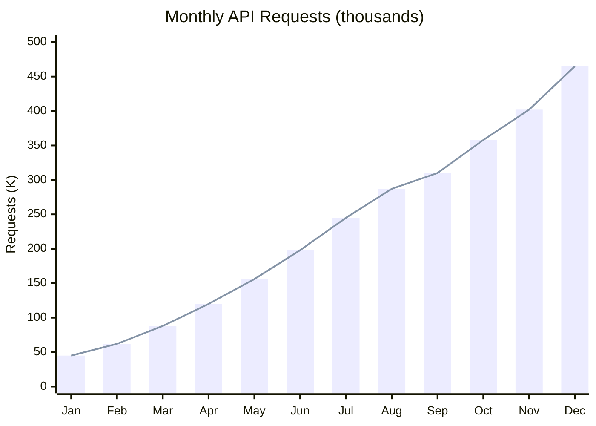

# API Request Volumes XY

## Mermaid

```mermaid
%% preset: xychart
xychart-beta
  title "Monthly API Requests (thousands)"
  x-axis [Jan, Feb, Mar, Apr, May, Jun, Jul, Aug, Sep, Oct, Nov, Dec]
  y-axis "Requests (K)" 0 --> 500
  bar [45, 62, 88, 120, 156, 198, 245, 287, 310, 358, 402, 465]
  line [45, 62, 88, 120, 156, 198, 245, 287, 310, 358, 402, 465]
```
