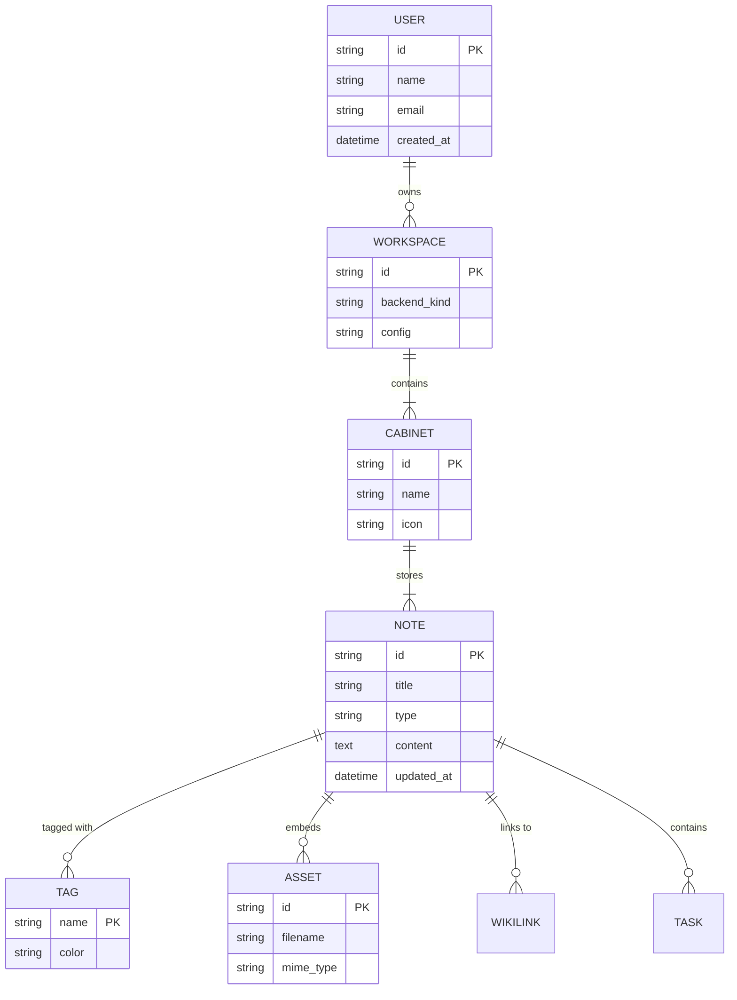

# Analytics Database ER

## Mermaid

```mermaid
%% preset: er
erDiagram
  USER ||--o{ WORKSPACE : owns
  WORKSPACE ||--|{ CABINET : contains
  CABINET ||--|{ NOTE : stores
  NOTE ||--o{ TAG : "tagged with"
  NOTE ||--o{ ASSET : embeds
  NOTE ||--o{ WIKILINK : "links to"
  NOTE ||--o{ TASK : contains
  USER {
    string id PK
    string name
    string email
    datetime created_at
  }
  WORKSPACE {
    string id PK
    string backend_kind
    string config
  }
  CABINET {
    string id PK
    string name
    string icon
  }
  NOTE {
    string id PK
    string title
    string type
    text content
    datetime updated_at
  }
  TAG {
    string name PK
    string color
  }
  ASSET {
    string id PK
    string filename
    string mime_type
  }
```
