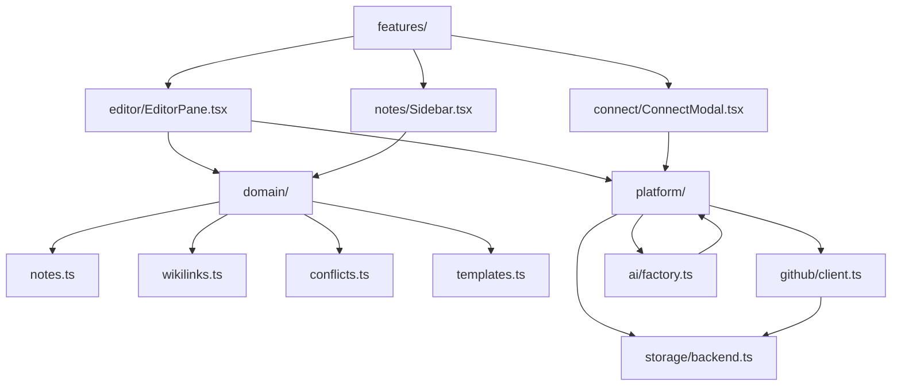

# Build Dependencies DAG

## Mode
- flowchart

## Mermaid

```mermaid
%% preset: dag
flowchart TB
  Domain["domain/"] --> Notes["notes.ts"]
  Domain --> Wikilinks["wikilinks.ts"]
  Domain --> Conflicts["conflicts.ts"]
  Domain --> Templates["templates.ts"]
  Platform["platform/"] --> GitHub["github/client.ts"]
  Platform --> Storage["storage/backend.ts"]
  Platform --> AI["ai/factory.ts"]
  Features["features/"] --> Editor["editor/EditorPane.tsx"]
  Features --> Sidebar["notes/Sidebar.tsx"]
  Features --> Connect["connect/ConnectModal.tsx"]
  Editor --> Domain
  Editor --> Platform
  Sidebar --> Domain
  Connect --> Platform
  GitHub --> Storage
  AI --> Platform
```
