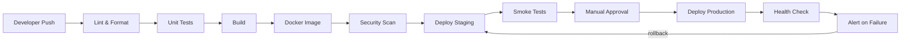

# CI/CD Pipeline Flowchart

## Mode
- flowchart

## Mermaid

```mermaid
%% mode: flowchart
flowchart LR
  Dev["Developer Push"] --> Lint["Lint & Format"]
  Lint --> Test["Unit Tests"]
  Test --> Build["Build"]
  Build --> Docker["Docker Image"]
  Docker --> Scan["Security Scan"]
  Scan --> Stage["Deploy Staging"]
  Stage --> Smoke["Smoke Tests"]
  Smoke --> Approve["Manual Approval"]
  Approve --> Prod["Deploy Production"]
  Prod --> Monitor["Health Check"]
  Monitor --> Alert["Alert on Failure"]
  Alert -->|rollback| Stage
```
