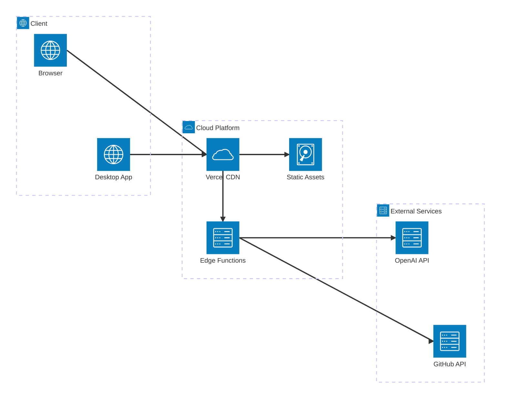

# Cloud Infrastructure Architecture

## Mermaid

```mermaid
%% preset: architecture
architecture-beta
  group cloud(cloud)[Cloud Platform]

  service vercel(cloud)[Vercel CDN] in cloud
  service edge(server)[Edge Functions] in cloud
  service static(disk)[Static Assets] in cloud

  group external(server)[External Services]

  service github(server)[GitHub API] in external
  service openai(server)[OpenAI API] in external

  group client(internet)[Client]

  service browser(internet)[Browser] in client
  service desktop(internet)[Desktop App] in client

  browser:R --> L:vercel
  desktop:R --> L:vercel
  vercel:R --> L:static
  vercel:B --> T:edge
  edge:R --> L:github
  edge:R --> L:openai
```
