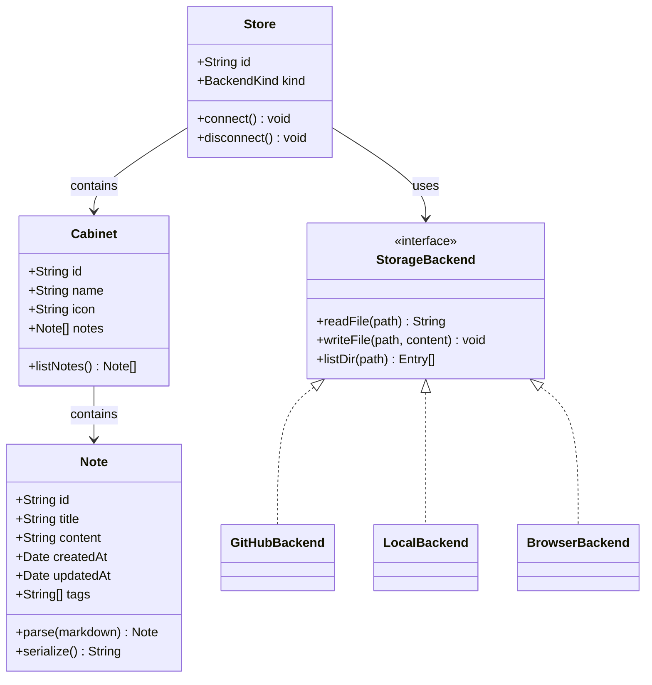

# Dashboard Domain Model Class

## Mermaid

```mermaid
%% preset: class
classDiagram
  class Note {
    +String id
    +String title
    +String content
    +Date createdAt
    +Date updatedAt
    +String[] tags
    +parse(markdown) Note
    +serialize() String
  }
  class Cabinet {
    +String id
    +String name
    +String icon
    +Note[] notes
    +listNotes() Note[]
  }
  class Store {
    +String id
    +BackendKind kind
    +connect() void
    +disconnect() void
  }
  class StorageBackend {
    <<interface>>
    +readFile(path) String
    +writeFile(path, content) void
    +listDir(path) Entry[]
  }
  Store --> Cabinet : contains
  Cabinet --> Note : contains
  Store --> StorageBackend : uses
  StorageBackend <|.. GitHubBackend
  StorageBackend <|.. LocalBackend
  StorageBackend <|.. BrowserBackend
```
