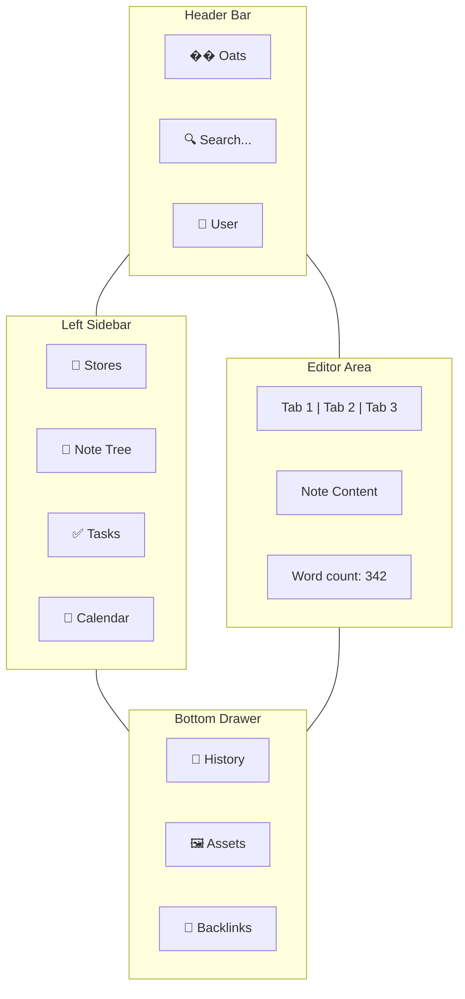

# Dashboard Navigation Wireframe

## Mermaid

```mermaid
%% preset: wireframe
flowchart TB
  subgraph Header["Header Bar"]
    Logo["�� Oats"]
    Search["🔍 Search..."]
    Profile["👤 User"]
  end
  subgraph Sidebar["Left Sidebar"]
    Nav["📁 Stores"]
    Tree["📄 Note Tree"]
    Tasks["✅ Tasks"]
    Cal["📅 Calendar"]
  end
  subgraph Main["Editor Area"]
    Tabs["Tab 1 | Tab 2 | Tab 3"]
    Editor["Note Content"]
    Status["Word count: 342"]
  end
  subgraph Inspector["Bottom Drawer"]
    History["📜 History"]
    Assets["🖼 Assets"]
    Links["🔗 Backlinks"]
  end
  Header --- Sidebar
  Header --- Main
  Sidebar --- Inspector
  Main --- Inspector
```
