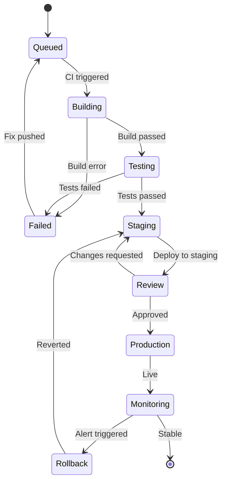

# Deployment Lifecycle State

## Mermaid

```mermaid
%% preset: state
stateDiagram-v2
  [*] --> Queued
  Queued --> Building: CI triggered
  Building --> Testing: Build passed
  Building --> Failed: Build error
  Testing --> Staging: Tests passed
  Testing --> Failed: Tests failed
  Staging --> Review: Deploy to staging
  Review --> Production: Approved
  Review --> Staging: Changes requested
  Production --> Monitoring: Live
  Monitoring --> Rollback: Alert triggered
  Rollback --> Staging: Reverted
  Failed --> Queued: Fix pushed
  Monitoring --> [*]: Stable
```
