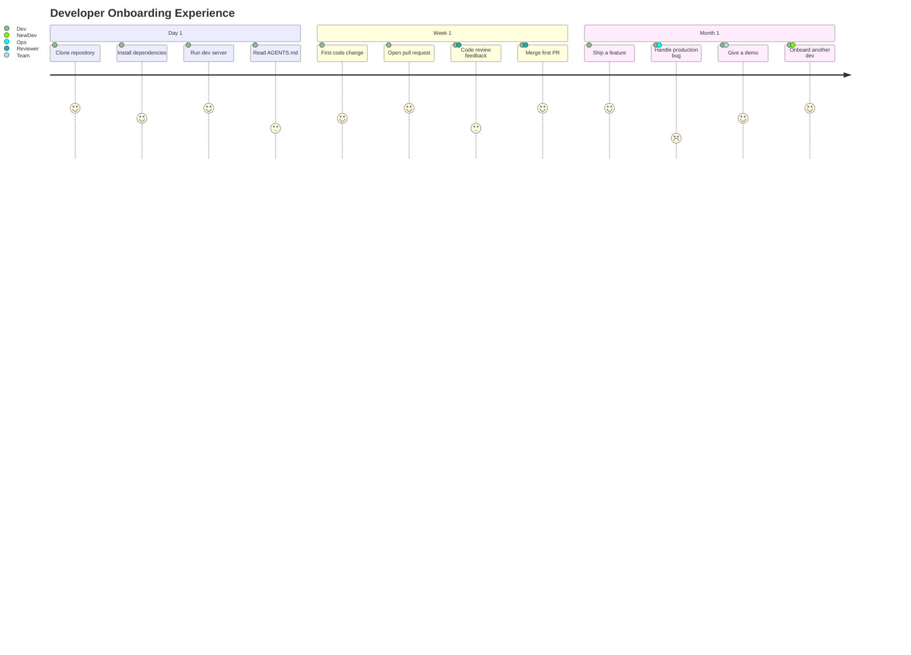

# Developer Onboarding Journey

## Mermaid

```mermaid
%% preset: journey
journey
  title Developer Onboarding Experience
  section Day 1
    Clone repository: 5: Dev
    Install dependencies: 4: Dev
    Run dev server: 5: Dev
    Read AGENTS.md: 3: Dev
  section Week 1
    First code change: 4: Dev
    Open pull request: 5: Dev
    Code review feedback: 3: Dev, Reviewer
    Merge first PR: 5: Dev, Reviewer
  section Month 1
    Ship a feature: 5: Dev
    Handle production bug: 2: Dev, Ops
    Give a demo: 4: Dev, Team
    Onboard another dev: 5: Dev, NewDev
```
