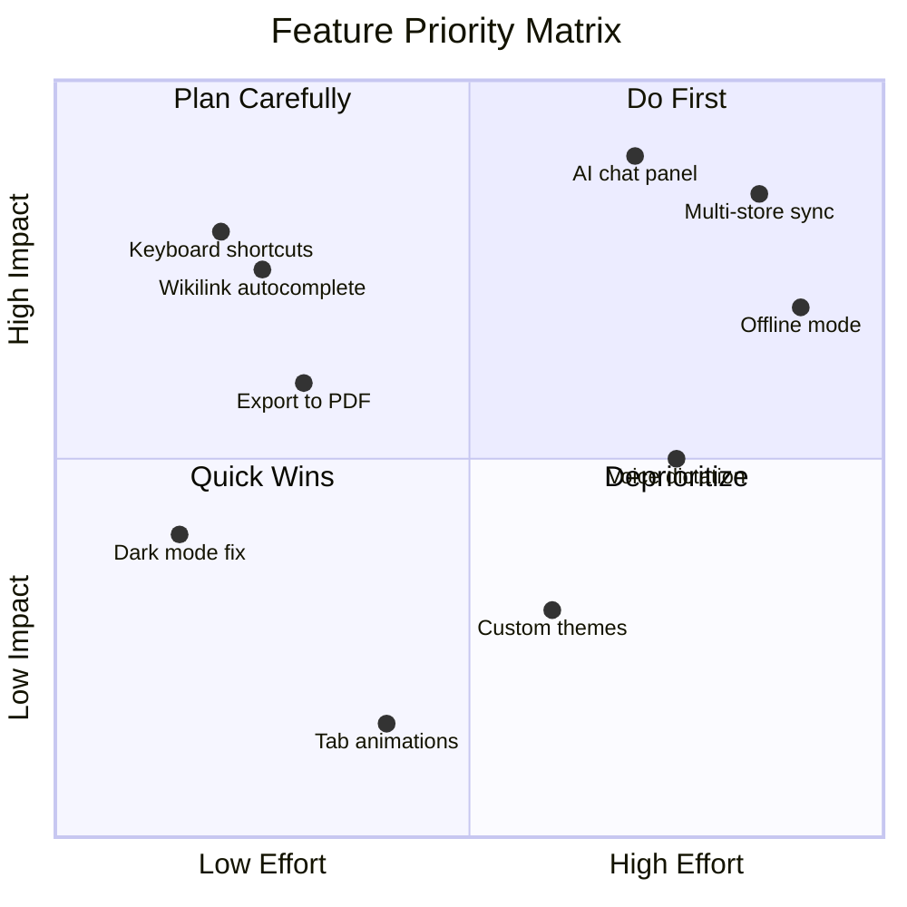

# Feature Priority Quadrant

## Mermaid

```mermaid
%% preset: quadrant
quadrantChart
  title Feature Priority Matrix
  x-axis Low Effort --> High Effort
  y-axis Low Impact --> High Impact
  quadrant-1 Do First
  quadrant-2 Plan Carefully
  quadrant-3 Quick Wins
  quadrant-4 Deprioritize
  Keyboard shortcuts: [0.2, 0.8]
  AI chat panel: [0.7, 0.9]
  Dark mode fix: [0.15, 0.4]
  Multi-store sync: [0.85, 0.85]
  Custom themes: [0.6, 0.3]
  Export to PDF: [0.3, 0.6]
  Voice dictation: [0.75, 0.5]
  Tab animations: [0.4, 0.15]
  Offline mode: [0.9, 0.7]
  Wikilink autocomplete: [0.25, 0.75]
```
