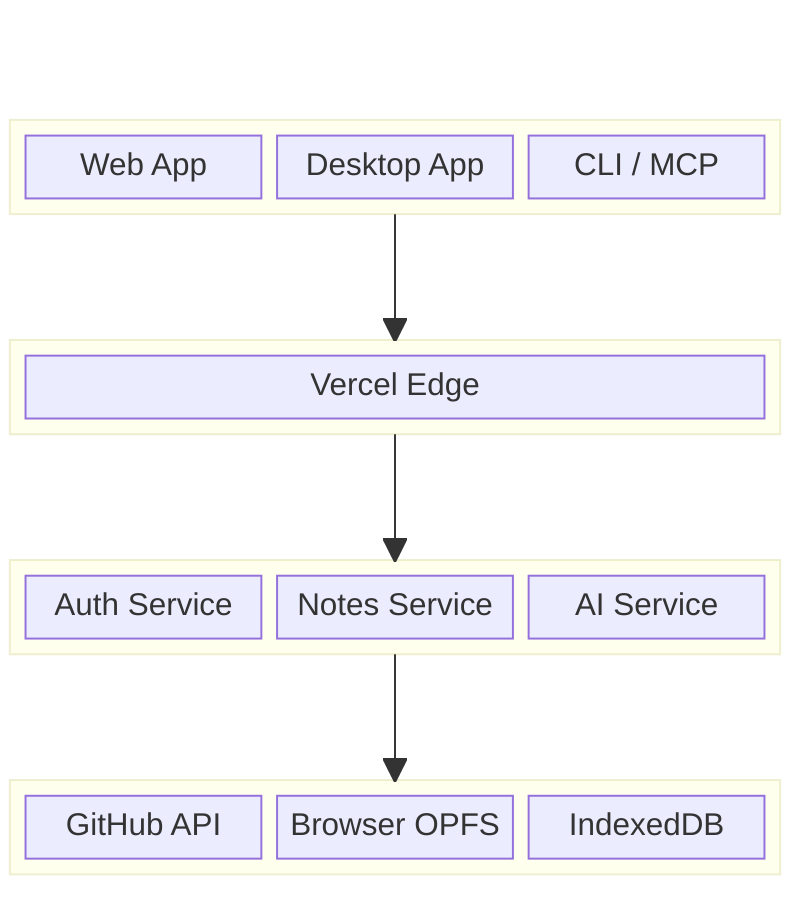

# Microservice Architecture Block

## Mermaid

```mermaid
%% preset: block
block-beta
  columns 3

  space:3

  block:clients["Client Layer"]:3
    Web["Web App"]
    Desktop["Desktop App"]
    CLI["CLI / MCP"]
  end

  space:3

  block:api["API Gateway"]:3
    Gateway["Vercel Edge"]
  end

  space:3

  block:services["Service Layer"]:3
    Auth["Auth Service"]
    Notes["Notes Service"]
    AI["AI Service"]
  end

  space:3

  block:storage["Storage Layer"]:3
    GitHub["GitHub API"]
    OPFS["Browser OPFS"]
    IDB["IndexedDB"]
  end

  clients --> api
  api --> services
  services --> storage
```
