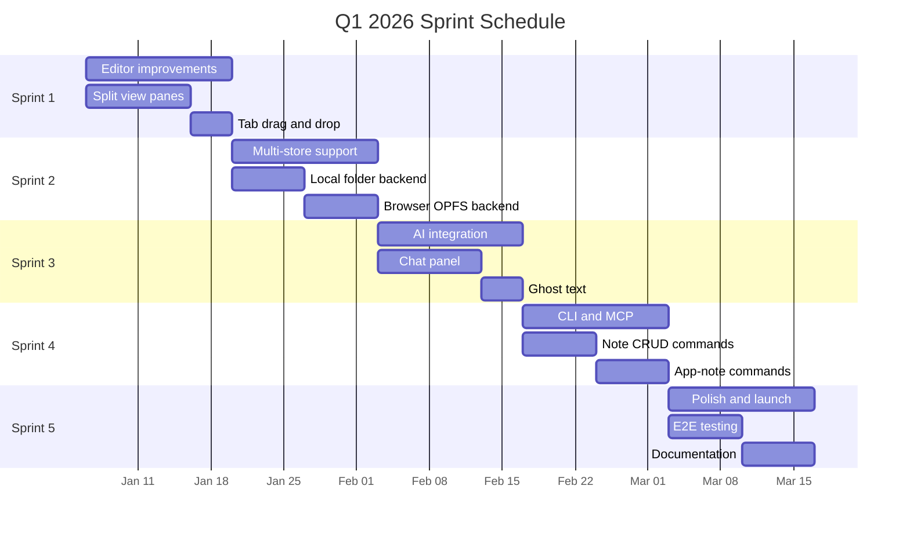

# Q1 Sprint Schedule Gantt

## Mermaid

```mermaid
%% preset: gantt
gantt
  title Q1 2026 Sprint Schedule
  dateFormat YYYY-MM-DD
  axisFormat %b %d

  section Sprint 1
    Editor improvements     :s1a, 2026-01-06, 14d
    Split view panes        :s1b, 2026-01-06, 10d
    Tab drag and drop       :s1c, after s1b, 4d

  section Sprint 2
    Multi-store support     :s2a, 2026-01-20, 14d
    Local folder backend    :s2b, 2026-01-20, 7d
    Browser OPFS backend    :s2c, after s2b, 7d

  section Sprint 3
    AI integration          :s3a, 2026-02-03, 14d
    Chat panel              :s3b, 2026-02-03, 10d
    Ghost text              :s3c, after s3b, 4d

  section Sprint 4
    CLI and MCP             :s4a, 2026-02-17, 14d
    Note CRUD commands      :s4b, 2026-02-17, 7d
    App-note commands       :s4c, after s4b, 7d

  section Sprint 5
    Polish and launch       :s5a, 2026-03-03, 14d
    E2E testing             :s5b, 2026-03-03, 7d
    Documentation           :s5c, after s5b, 7d
```
