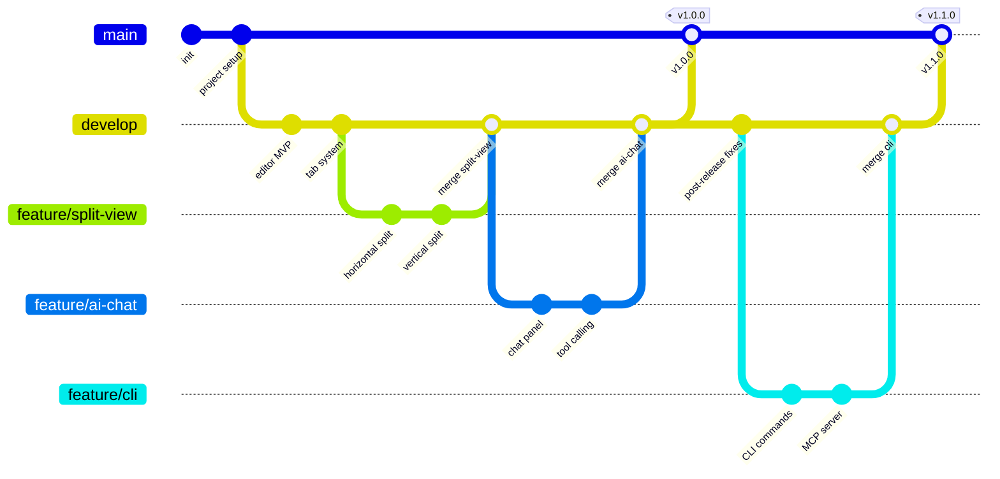

# Release Branching Gitgraph

## Mermaid

```mermaid
%% preset: gitgraph
gitGraph
  commit id: "init"
  commit id: "project setup"
  branch develop
  checkout develop
  commit id: "editor MVP"
  commit id: "tab system"
  branch feature/split-view
  checkout feature/split-view
  commit id: "horizontal split"
  commit id: "vertical split"
  checkout develop
  merge feature/split-view id: "merge split-view"
  branch feature/ai-chat
  checkout feature/ai-chat
  commit id: "chat panel"
  commit id: "tool calling"
  checkout develop
  merge feature/ai-chat id: "merge ai-chat"
  checkout main
  merge develop id: "v1.0.0" tag: "v1.0.0"
  checkout develop
  commit id: "post-release fixes"
  branch feature/cli
  checkout feature/cli
  commit id: "CLI commands"
  commit id: "MCP server"
  checkout develop
  merge feature/cli id: "merge cli"
  checkout main
  merge develop id: "v1.1.0" tag: "v1.1.0"
```
