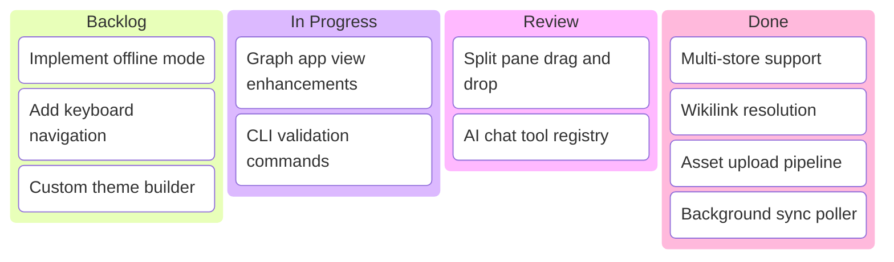

# Sprint Board Kanban

## Mermaid

```mermaid
%% preset: kanban
kanban
  column1["Backlog"]
    task1["Implement offline mode"]
    task2["Add keyboard navigation"]
    task3["Custom theme builder"]
  column2["In Progress"]
    task4["Graph app view enhancements"]
    task5["CLI validation commands"]
  column3["Review"]
    task6["Split pane drag and drop"]
    task7["AI chat tool registry"]
  column4["Done"]
    task8["Multi-store support"]
    task9["Wikilink resolution"]
    task10["Asset upload pipeline"]
    task11["Background sync poller"]
```
