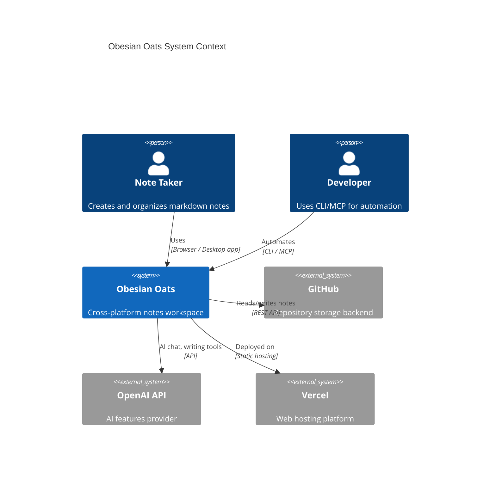

# System Landscape C4

## Mermaid

```mermaid
%% preset: c4
C4Context
  title Obesian Oats System Context

  Person(user, "Note Taker", "Creates and organizes markdown notes")
  Person(dev, "Developer", "Uses CLI/MCP for automation")

  System(oats, "Obesian Oats", "Cross-platform notes workspace")

  System_Ext(github, "GitHub", "Repository storage backend")
  System_Ext(openai, "OpenAI API", "AI features provider")
  System_Ext(vercel, "Vercel", "Web hosting platform")

  Rel(user, oats, "Uses", "Browser / Desktop app")
  Rel(dev, oats, "Automates", "CLI / MCP")
  Rel(oats, github, "Reads/writes notes", "REST API")
  Rel(oats, openai, "AI chat, writing tools", "API")
  Rel(oats, vercel, "Deployed on", "Static hosting")
```
