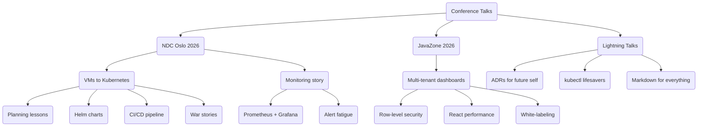

# Conference Talk Ideas Mindmap

## Mode
- mindmap

## Mermaid

```mermaid
%% mode: mindmap
flowchart TB
  ROOT("Conference Talks") --> NDC("NDC Oslo 2026")
  ROOT --> JZ("JavaZone 2026")
  ROOT --> LIGHT("Lightning Talks")
  NDC --> NDC1("VMs to Kubernetes")
  NDC1 --> NDC1A("Planning lessons")
  NDC1 --> NDC1B("Helm charts")
  NDC1 --> NDC1C("CI/CD pipeline")
  NDC1 --> NDC1D("War stories")
  NDC --> NDC2("Monitoring story")
  NDC2 --> NDC2A("Prometheus + Grafana")
  NDC2 --> NDC2B("Alert fatigue")
  JZ --> JZ1("Multi-tenant dashboards")
  JZ1 --> JZ1A("Row-level security")
  JZ1 --> JZ1B("React performance")
  JZ1 --> JZ1C("White-labeling")
  LIGHT --> L1("ADRs for future self")
  LIGHT --> L2("kubectl lifesavers")
  LIGHT --> L3("Markdown for everything")
```
