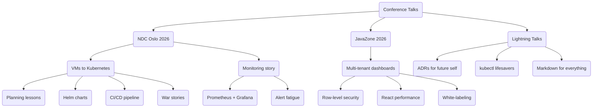

## Conference Talk Ideas

### NDC Oslo 2026 (CFP deadline: March 15)

**Primary idea:** "From VMs to Kubernetes: A Practical Migration Story"

- 45-minute talk
- Real-world lessons from migrating 12 microservices to AKS
- Cover: planning, Helm charts, CI/CD, monitoring, rollback strategies
- Include war stories and things that went wrong
- Target audience: Backend developers and DevOps engineers

**Outline draft:**

1. Why we migrated (costs, scaling, developer experience)
2. Planning phase — what we wish we knew
3. Containerization gotchas (stateful services, local file deps)
4. CI/CD pipeline design with GitHub Actions
5. The migration itself — blue-green deployment in practice
6. Monitoring and observability (Prometheus + Grafana)
7. Lessons learned and metrics (before/after comparison)
8. Q&A

### JavaZone 2026 (September)

**Idea:** "Building Multi-Tenant Analytics Dashboards with React and Row-Level Security"

- Focus on the Customer Dashboard project
- How to implement row-level security that actually works
- Performance optimization for real-time data visualization
- White-labeling patterns

### Lightning Talk Ideas (10 min)

- "ADRs: The Documentation Your Future Self Will Thank You For"
- "5 kubectl Commands That Will Save Your Production"
- "Why I Switched to Markdown for Everything"

### Speaking Tips (from last year's NDC)

- Practice 3x minimum with timer
- Have a backup laptop with slides on USB
- Arrive 30 min early to test projector
- Bring water bottle and throat lozenges
- End 5 min early for Q&A — never run over

