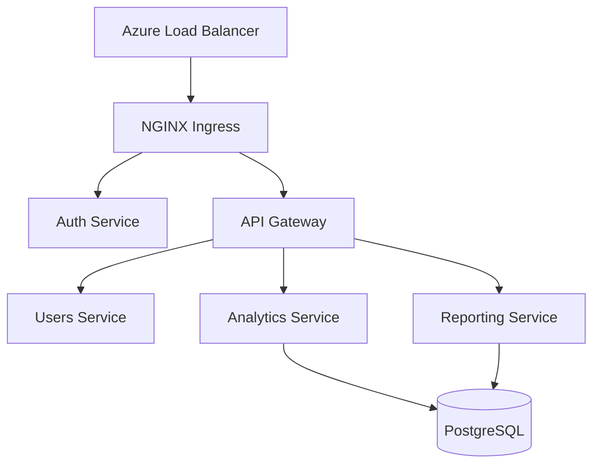

# AKS Architecture Review

**Date:** 2026-02-05
**Attendees:** Alex Lindström, Erik Hansen, Maja Solberg, Jonas Berg, Lisa Park (Security)
**Location:** Virtual (Teams)

## Discussion

Erik walked through the proposed cluster architecture. Two node pools: system (always-on, 3 nodes) and user (auto-scaling 2-8 nodes).

Lisa raised security points:
- Azure Policy for pod security (no privileged containers)
- Network policies to isolate namespaces
- Key Vault integration for secrets
- Regular vulnerability scanning

**Monitoring decision:** Prometheus + Grafana in-cluster, with Azure Monitor as backup.

### Architecture

## Action Items

- [x] Erik: Implement network policies <!-- task:ar-1 -->
- [x] Jonas: Set up Key Vault CSI driver <!-- task:ar-3 -->
- [ ] Alex: Configure Grafana dashboards due:2026-02-20 @Alex <!-- task:ar-4 -->
