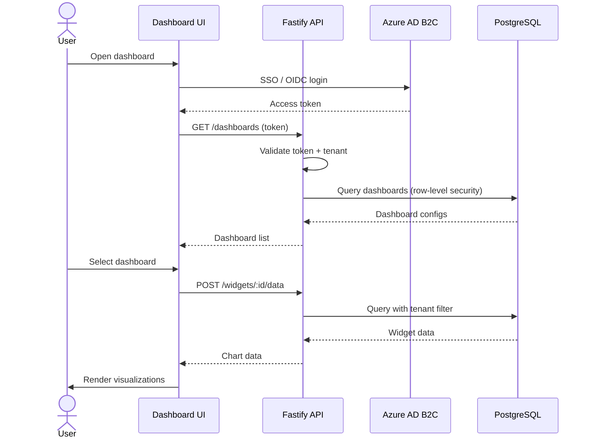

## Customer Dashboard — Functional Requirements

### API Request Flow



### User Roles

| Role | Permissions |
|------|------------|
| Admin | Full access, user management, white-label config |
| Analyst | View all dashboards, create custom views, export |
| Viewer | View assigned dashboards only, no export |

### Core Features (MVP)

#### 1. Dashboard Layout
- Drag-and-drop widget grid (12-column responsive)
- Save and load custom layouts per user
- At least 5 widget types: bar chart, line chart, pie chart, table, KPI card
- Auto-refresh with configurable interval (1min, 5min, 15min)

#### 2. Data Filtering
- Global date range picker (presets + custom range)
- Per-widget filters (dimension dropdowns)
- Filter presets saved per user
- Cross-widget filtering (click a bar to filter other widgets)

#### 3. Authentication
- Customer SSO via SAML 2.0 or OIDC
- Azure AD B2C as identity broker
- Session timeout: 30 minutes idle
- MFA support for admin users

#### 4. Export
- Widget-level export (PNG, CSV)
- Full dashboard export as PDF
- Scheduled email reports (daily, weekly, monthly)
- Excel export for tables (with formatting)

### Non-Functional Requirements

- Page load: < 2 seconds for dashboard with 6 widgets
- Data freshness: < 5 minutes from source
- Concurrent users: 500 per customer tenant
- WCAG AA accessibility compliance
- GDPR compliant (data residency in EU)

### API Endpoints Needed

```
GET  /api/v1/dashboards          — list dashboards
GET  /api/v1/dashboards/:id      — get dashboard config
PUT  /api/v1/dashboards/:id      — update layout
POST /api/v1/widgets/:id/data    — fetch widget data
GET  /api/v1/exports/:id         — download export
POST /api/v1/reports/schedule    — create scheduled report
```

See [[Work/Projects/Customer Dashboard|Project overview]] for timeline.
