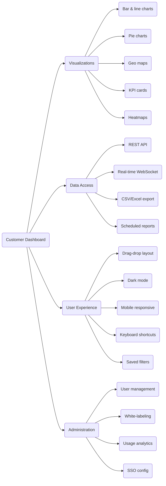

# Feature Brainstorm

## Mode
- mindmap

## Mermaid

```mermaid
%% mode: mindmap
flowchart LR
  ROOT("Customer Dashboard")
  VIZ("Visualizations")
  DATA("Data Access")
  UX("User Experience")
  ADMIN("Administration")
  V1("Bar & line charts")
  V2("Pie charts")
  V3("Geo maps")
  V4("KPI cards")
  V5("Heatmaps")
  D1("REST API")
  D2("Real-time WebSocket")
  D3("CSV/Excel export")
  D4("Scheduled reports")
  U1("Drag-drop layout")
  U2("Dark mode")
  U3("Mobile responsive")
  U4("Keyboard shortcuts")
  U5("Saved filters")
  A1("User management")
  A2("White-labeling")
  A3("Usage analytics")
  A4("SSO config")
  ROOT --> VIZ
  ROOT --> DATA
  ROOT --> UX
  ROOT --> ADMIN
  VIZ --> V1
  VIZ --> V2
  VIZ --> V3
  VIZ --> V4
  VIZ --> V5
  DATA --> D1
  DATA --> D2
  DATA --> D3
  DATA --> D4
  UX --> U1
  UX --> U2
  UX --> U3
  UX --> U4
  UX --> U5
  ADMIN --> A1
  ADMIN --> A2
  ADMIN --> A3
  ADMIN --> A4
```
