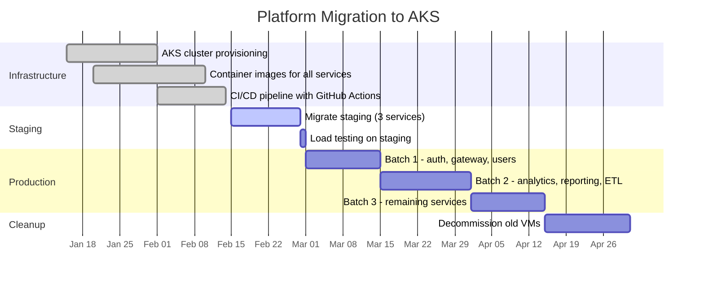

# Platform Migration to Azure Kubernetes

## Overview

Migration of our core analytics platform from on-premise VMs to Azure Kubernetes Service (AKS). This is the highest priority initiative for Q1 2026. Target: auto-scaling, improved observability, and 40% reduction in hosting costs.

## Goals

1. Move all 12 microservices from legacy VM deployment to containerized AKS infrastructure
2. Achieve auto-scaling and improved observability
3. Reduce hosting costs by 40% (€18k/month → €10k/month)

## Migration Timeline

## Milestones

### Infrastructure Setup

- [x] Infrastructure planning and AKS cluster provisioning <!-- task:3acsduep -->
- [x] Container images for all services <!-- task:j98zsd8j -->
- [x] CI/CD pipeline with GitHub Actions <!-- task:6amx6e2a -->

### Migration Batches (2026-02-15 → 2026-05-01)

- [ ] Migrate staging environment (3 services) @Erik <!-- task:030rzq09 -->
- [ ] Load testing on staging due:2026-03-01 <!-- task:qcw0ptyt -->
- [ ] Migrate production - batch 1 (auth, gateway, users) due:2026-03-15 @Alex <!-- task:ka4vol1n -->
- [ ] Migrate production - batch 2 (analytics, reporting, ETL) due:2026-04-01 @Maja <!-- task:46tjl9rp -->
- [ ] Migrate production - batch 3 (remaining services) due:2026-04-15 <!-- task:zlfhvcj1 -->
- [ ] Decommission old VMs due:2026-05-01 <!-- task:l5lw95rm -->

## Resources

- [AKS Documentation](https://learn.microsoft.com/en-us/azure/aks/)
- [[Work/Meetings/Platform Migration Kickoff|Kickoff Meeting Notes]]
- [[Work/Meetings/AKS Architecture Review|Architecture Review]]

## Notes

- **AKS Cluster:** Region Norway East, System pool (3x D4s_v3) + User pool (auto-scale 2-8x D8s_v3)
- **Ingress:** NGINX with cert-manager for TLS
- **Monitoring:** Prometheus + Grafana stack
- **Decisions:** Helm charts, Azure Container Registry, Managed PostgreSQL stays, Redis in AKS
- **Risks:** Service downtime (mitigated by blue-green), data sync (parallel run 2 weeks), team capacity (dedicated sprints)
