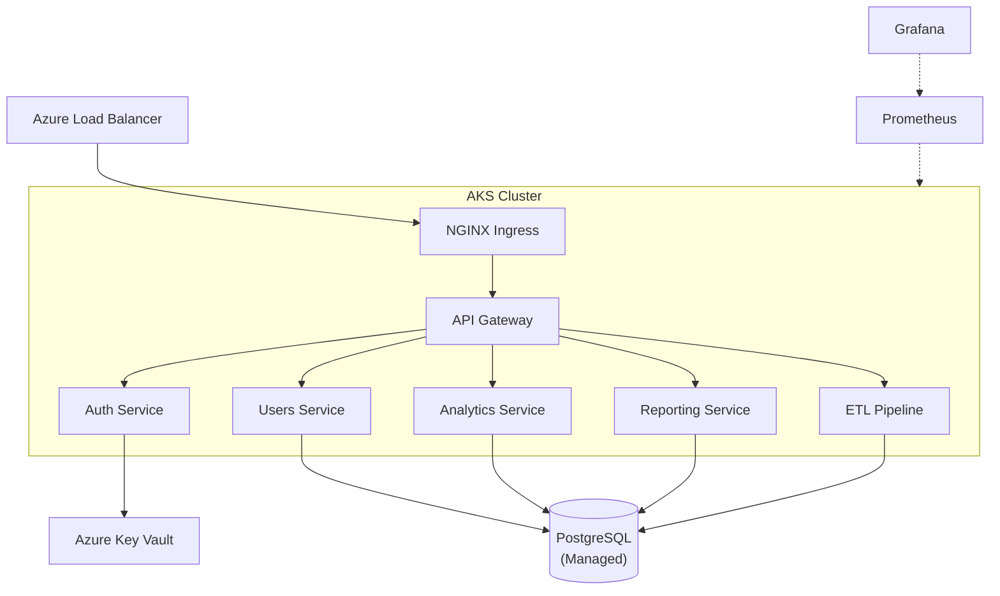

## Infrastructure Overview

## ADR-001: Container Orchestration Platform

**Status:** Accepted
**Date:** 2026-01-10
**Deciders:** Alex Lindström, Karin Olsen (CTO), Erik Hansen

### Context

We need to migrate 12 microservices from on-premise VMs to a cloud-native platform. Options considered:
1. Azure Kubernetes Service (AKS)
2. Azure Container Apps
3. AWS ECS/Fargate
4. Docker Swarm on VMs

### Decision

**Azure Kubernetes Service (AKS)**

### Rationale

- Team has existing Kubernetes experience from dev environments
- AKS integrates well with our Azure AD and existing Azure resources
- Full control over networking, scaling, and monitoring
- Strong ecosystem (Helm, ArgoCD, Prometheus)
- Container Apps was tempting for simplicity but lacks the flexibility we need for our service mesh requirements

### Consequences

- Higher operational complexity than Container Apps
- Need to invest in Kubernetes training for Maja and Sofie
- Must manage cluster upgrades and node pool scaling ourselves
- Benefit: Full portability if we ever need to move to another cloud

---

## ADR-002: Secret Management Strategy

**Status:** Accepted
**Date:** 2026-01-22
**Deciders:** Alex Lindström, Lisa Park (Security), Jonas Berg

### Context

Services currently read secrets from environment variables set on VMs. Need a more secure approach for Kubernetes.

### Decision

**Azure Key Vault with CSI Secret Store Driver**

### Rationale

- Secrets never stored in Kubernetes etcd (more secure)
- Centralized rotation and auditing via Azure Key Vault
- CSI driver mounts secrets as files in pods — no code changes needed
- Lisa approved this approach in the security review

### Consequences

- Slight added complexity in Helm charts (CSI volume mounts)
- Need to set up workload identity for each service
- Secrets rotation requires pod restart (acceptable trade-off)

---

## ADR-003: Monitoring Stack

**Status:** Accepted
**Date:** 2026-02-05
**Deciders:** Alex Lindström, Jonas Berg, Maja Solberg

### Context

Need observability for AKS cluster and all microservices.

### Decision

**Prometheus + Grafana in-cluster, Azure Monitor as backup**

### Rationale

- Team knows Prometheus/Grafana well
- Rich ecosystem of exporters and dashboards
- Azure Monitor provides infrastructure-level insights we cannot get from Prometheus alone
- Cost: Prometheus stack is free; Azure Monitor basic tier is within budget

See [[Work/Meetings/AKS Architecture Review|Architecture Review meeting notes]] for full discussion.
