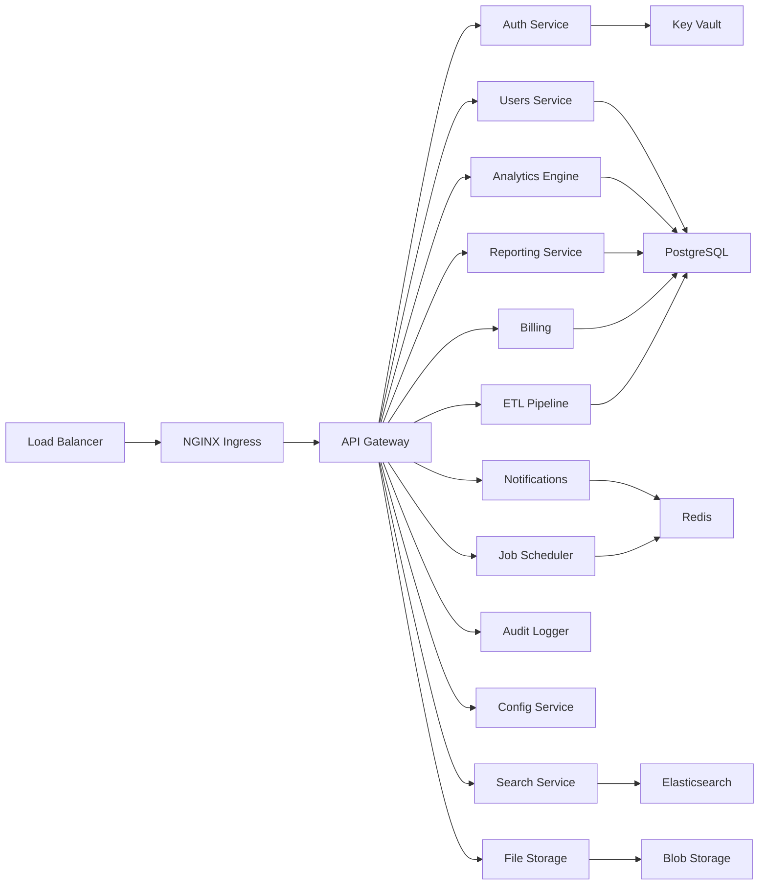

# Service Architecture

## Mode
- flowchart

## Mermaid

```mermaid
%% mode: flowchart
flowchart LR
  LB["Load Balancer"] --> NGINX["NGINX Ingress"]
  NGINX --> GW["API Gateway"]
  GW --> AUTH["Auth Service"]
  GW --> USERS["Users Service"]
  GW --> ANALYTICS["Analytics Engine"]
  GW --> REPORTING["Reporting Service"]
  GW --> ETL["ETL Pipeline"]
  GW --> NOTIFY["Notifications"]
  GW --> SEARCH["Search Service"]
  GW --> BILLING["Billing"]
  GW --> AUDIT["Audit Logger"]
  GW --> CONFIG["Config Service"]
  GW --> SCHEDULER["Job Scheduler"]
  GW --> FILES["File Storage"]
  USERS --> PG["PostgreSQL"]
  ANALYTICS --> PG
  REPORTING --> PG
  BILLING --> PG
  ETL --> PG
  SEARCH --> ELASTIC["Elasticsearch"]
  NOTIFY --> REDIS["Redis"]
  SCHEDULER --> REDIS
  AUTH --> KEYVAULT["Key Vault"]
  FILES --> BLOB["Blob Storage"]
```
