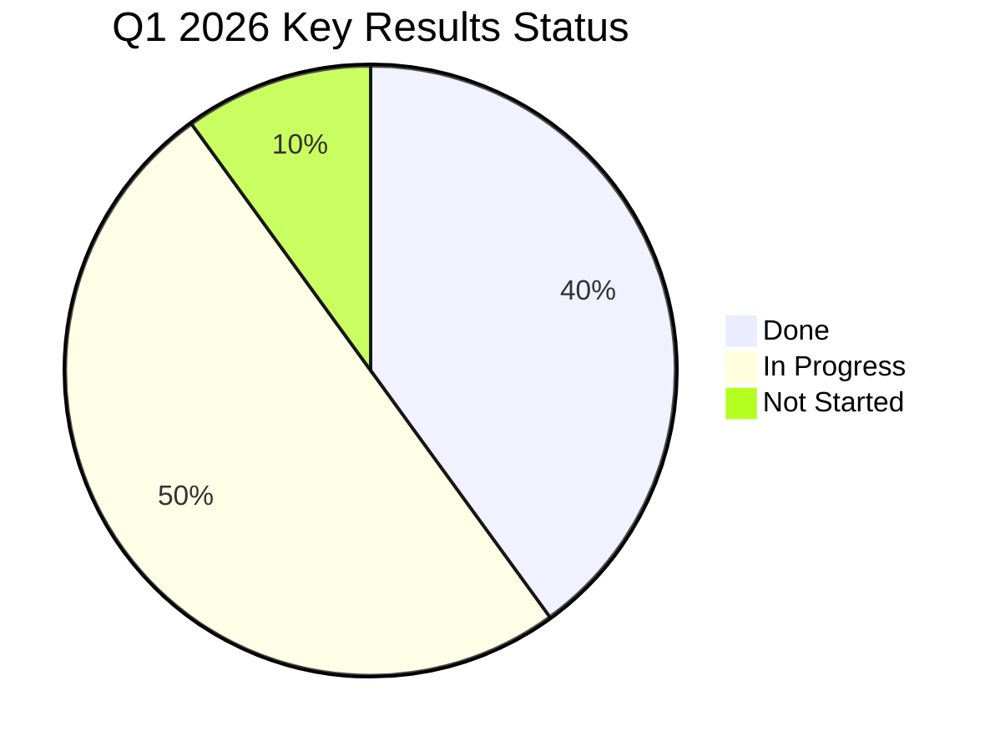

## Q1 2026 — Objectives and Key Results

### Progress Overview

### Objective 1: Complete Platform Migration Phase 1

*Owner: Alex Lindström*

| Key Result                  | Target               | Current     | Status |
| --------------------------- | -------------------- | ----------- | ------ |
| Migrate staging environment | 3 services           | 3           | ✅ Done |
| Complete load testing       | All pass             | In progress | 🔄     |
| Migrate production batch 1  | 3 services by Mar 15 | Not started | ⏳      |
| Reduce hosting costs        | -20% from baseline   | -5%         | 🔄     |

### Objective 2: Launch Customer Dashboard Beta

*Owner: Sofie Dahl*

| Key Result                         | Target | Current      | Status |
| ---------------------------------- | ------ | ------------ | ------ |
| Core dashboard with 5 widget types | 5      | 4 done       | 🔄     |
| SSO with 3 pilot customers         | 3      | 2 configured | 🔄     |
| Page load time                     | < 2s   | 1.8s         | ✅ Done |

### Objective 3: Improve Engineering Excellence

*Owner: Jonas Berg*

| Key Result             | Target  | Current  | Status |
| ---------------------- | ------- | -------- | ------ |
| CI/CD reliability      | > 99%   | 94%      | 🔄     |
| Code review turnaround | < 1 day | 1.8 days | 🔄     |
| Test coverage          | > 80%   | 73%      | 🔄     |
| Critical incidents     | 0       | 0        | ✅      |

See [[Work/Projects/Platform Migration|Platform Migration]] and [[Work/Projects/Customer Dashboard|Customer Dashboard]] for details.
